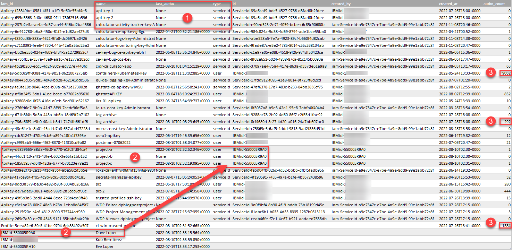

# Information about inactive identities, API keys, and access policies in your IBM Cloud account
Retrieve information about IBM Cloud IAM keys. Identify inactive identities and policies. The requests with `curl` and those in the Python script utilize the [IBM Cloud IAM Identity Services API](https://cloud.ibm.com/apidocs/iam-identity-token-api) and [IBM Cloud IAM Policy Management API](https://cloud.ibm.com/apidocs/iam-policy-management). 


### Preparation
All commands and scripts can be run in IBM Cloud Shell. The following steps are needed to get started.
1. Visit https://cloud.ibm.com, if not done log in, then open the [IBM Cloud Shell](https://cloud.ibm.com/shell).
2. In the new terminal, set an environment variable with the access token for you session:
   ```sh
   export IBMCLOUD_TOKEN=$(ibmcloud iam oauth-tokens --output json | jq -r '.iam_token')
   ```
3. Set an environment variable with the account ID:
   ```
   export IBMCLOUD_ACCOUNTID=$(ibmcloud account show --output json | jq -r '.account_id')
   ```


### A) Use curl to trigger and retrieve report on inactive identities
With the above preparations, you can use the command line investigate inactive identities in your IBM Cloud account.

1. Trigger a new report about inactive identities. The result is the reference to the new report.
   ```
   curl -X POST "https://iam.cloud.ibm.com/v1/activity/accounts/${IBMCLOUD_ACCOUNTID}/report" \
   -H "Authorization: ${IBMCLOUD_TOKEN}" -H 'Content-Type: application/json' 
   ```
   By default, the duration is 720 hours which is 30 days. You can change the duration by passing in an additional parameter. Adapt it to your preferences (shown for 90 days):
   ```
   curl -X POST "https://iam.cloud.ibm.com/v1/activity/accounts/${IBMCLOUD_ACCOUNTID}/report?duration=2160" \
   -H "Authorization: ${IBMCLOUD_TOKEN}" -H 'Content-Type: application/json' 
   ```
2. A some seconds to minute, you can retrieve the report. Using **latest** as reference, the latest available report is returned. Replace **latest** with the reference from the previous command to retrieve that specific report.
   ```
   curl -s -X GET "https://iam.cloud.ibm.com/v1/activity/accounts/${IBMCLOUD_ACCOUNTID}/report/latest" \
   -H "Authorization: ${IBMCLOUD_TOKEN}" -H 'Content-Type: application/json' | jq
   ```

The Python script in section B.2 uses the same API functions as above.

### B) Use Python to investigate your API keys and the API keys for your service IDs

#### 1) Individual API functions: IAMkeys.py
1. Download and save the Python script:
   ```
   wget https://raw.githubusercontent.com/data-henrik/ibmcloud-iam-keys-identities/main/IAMkeys.py
   ```

2. Run the Python script:
   ```
   python3 IAMkeys.py
   ```
   By default, it produces the output as table with comma-separated values (CSV) with a subset of attributes, printing is immediate. The following parameter allows generating output in JSON format with all attributes included:
   ```
   python3 IAMkeys.py --output JSON
   ```
   Note that to produce JSON output all data needs to be retrieved first before printing. 

   If you don't have privileges on the account level, you might run into access errors. The script supports a slower way of retrieving information. Use the following parameter to apply that mode:
   ```
   python3 IAMkeys.py --type user
   ```

3. You may want to redirect the JSON output to a file for post-processing. 
   ```
   python3 IAMkeys.py --output JSON > myapikeys.json
   ```

#### 2) Trigger and get the report in inactive identities: IAMia.py

1. Download and save the Python script:
   ```
   wget https://raw.githubusercontent.com/data-henrik/ibmcloud-iam-keys-identities/main/IAMia.py
   ```
2. Create (trigger) a new report on inactive identities:
   ```
   python3 IAMia.py --action trigger
   ```
   This will trigger the creation of a new report with the default duration of 720 hours. To have a duration of 1440 hours (60 days), use an additional parameter:
   ```
   python3 IAMia.py --action trigger --duration 1440
   ```
   The result is the report ID which can be used when retrieving a report.

3. Retrieve an existing report by running the Python script:
   ```
   python3 IAMia.py
   ```

   With no parameters, it retrieves the latest report on inactive identities and prints it converted to CSV format (comma-separated values). To see the original JSON-based report, use the additional parameter:

   ```
   python3 IAMia.py --output JSON
   ```
   Running the above is the same as:
   ```
   python3 IAMia.py --action get --reportid latest --level standard --output JSON
   ```
   The script is instructed to get the latest report and print it as JSON with no further processing ("standard"). Instead of retrieving the latest report, you can also specify the report ID from the previous step. Note that if not retrieving the latest, the report should not be older than 24 hours.

   To produce detailed output in CSV format with the history and authentication counts included, run the following:
   ```
   python3 IAMia.py --action get --reportid latest --level advanced --output CSV
   ```
   or the shorter equivalent
   ```
   python3 IAMia.py --level advanced
   ```


### C) Use Python to investigate inactive or unused IAM access policies
1. Download and save the Python script:
   ```
   wget https://raw.githubusercontent.com/data-henrik/ibmcloud-iam-keys-identities/main/IAMpolicies.py
   ```

2. Run the Python script:
   ```
   python3 IAMpolicies.py
   ```
   By default, it produces the output as table with comma-separated values (CSV) with a subset of attributes, printing is immediate. The following parameter allows generating output in JSON format with all attributes included:
   ```
   python3 IAMpolicies.py --output JSON
   ```
   Note that to produce JSON output all data needs to be retrieved first before printing. 

   Use the help parameter to see further filtering options. They allow to reduce the output to a specific policy type or IAM object type like access group.
   ```
   python3 IAMpolicies.py --help
   ```

3. You may want to redirect the JSON output to a file for post-processing. 
   ```
   python3 IAMpolicies.py --output JSON > mypolicies.json
   ```


### D) Post-processing of data
You can import a CSV-formatted report into a spreadsheet or database table for further processing. Some ideas for the report generated by IAMia.py:
1. Filter using the **last_authn** column and identify all API keys, users or trusted profiles that have never authenticated.
2. Identify a user with multiple API keys in your account; some of them are used and others are not. 
3. Identify users, trusted profiles or service IDs that have a high authentication count and investigate if that should be of concern. 



To process JSON data, you can use `jq`.
1. Search for all API keys with an **authn_count** of zero (0):
   ```
   cat myapikeys.json | jq -r '.[] | select(.activity | .authn_count==0)'
   ```
   The same, but only return a subset of the properties:
   ```
   cat myapikeys.json | jq -r '.[] | select(.activity | .authn_count==0) | {id,name,description,history,activity,created_at}'
   ```
2. Instead of checking for **authn_count** of zero, probing for a count of over ten is possible, too.
   ```
   cat myapikeys.json | jq -r '.[] | select(.activity | .authn_count>10)'
   ```
3. Identify all API keys that don't have a description.
   ```
   cat myapikeys.json | jq -r '.[] | select(.description=="" ) | {id,name,description,history,activity,created_at}'
   ```
## License
See the [LICENSE](LICENSE) file.